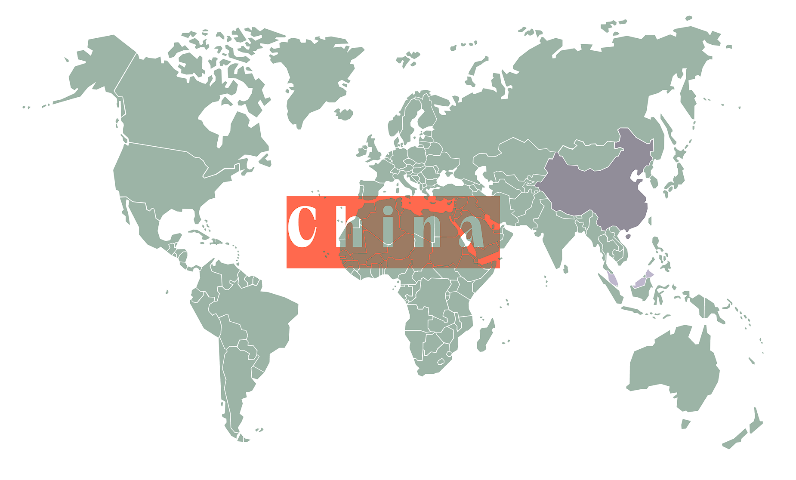
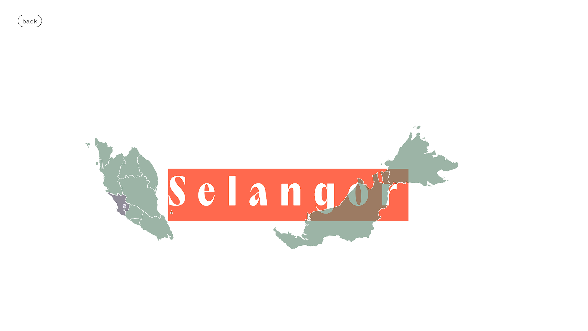
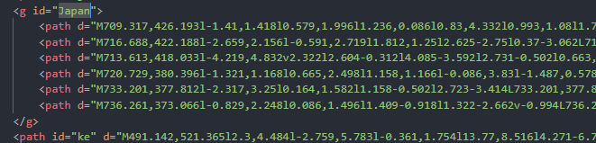

# MapJS

by Angus Tan 2024.

---

# What, Why, How

Interactive world map.

- Able to unlock country by input country to hasTravelled in the **world config file**.
- Able to unlock state by input state to hasTravelled in the **country config file**
- Able to put data into each state inside the **state config file**
- Visualize the place you've been with FUN!
- What's cool? It's serverless & easy to use!





---

# Assets

World Map

- not founded yet, included in the package

Country Map
https://simplemaps.com/resources/svg-maps

---

# How to use?

### The root path
1. const rootPath = "/components/mapJS"; (The root path of the module)
2. const worldJsonPath = "/datas/mapProperties.json"; (Store the country that you've gone to.)
3. const countriesJsonRootPath = "/datas/Countries"; (Store the province that you've gone to.)

### How to add Countries
1. Under `mapProperties.json` add the country that you've been
2. Something like this (Example: Japan)
```json
{
	"hasTravelled":["China","Malaysia","Japan"]
}
```
3. Download the Country SVG Map from https://simplemaps.com/resources/svg-maps
4. Paste the downloaded Country SVG Map to `./mapJS/svg/countries`, MAKE Sure is same name on step 2.
5. IMPORTANT - the name should be same with the id in world-map svg

- picture above shown **jp** changed to **Japan**
- **ke** should be changed to fullname if you've been

### How to add province
1. Create a json file under **countriesJsonRootPath** 
2. With structure like this.
```json
{
    "hasTravelled": ["Kualalumpur", "Selangor"],
    ... provinces, also change it to **FULLNAME**    
}
```

### The function that you should be noticing (For state actions).

```js
function mapClick(event) {
  var countryCode = getCountryCode(event);

  var country = svgDoc.querySelector(`#${countryCode}`);

  globalContext.selectedCountry.setState({ country: countryCode });
}

function provinceClick(event, doc) {
  let countryCode = getCountryCode(event);
  let province = doc.querySelector(`#${countryCode}`);

  globalContext.selectedProvince.setState({ province: countryCode });
}
```

- create a global state to store the selected province for you item.
- make use of the selected province and country

