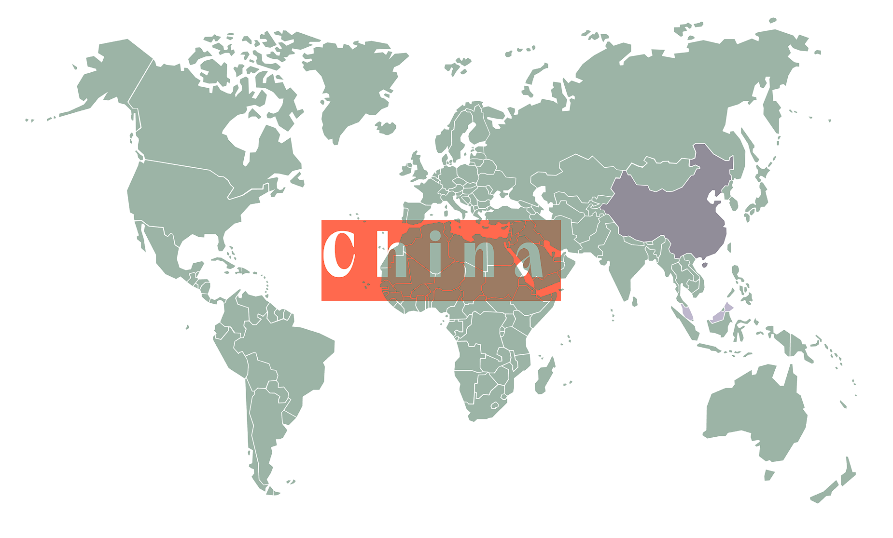
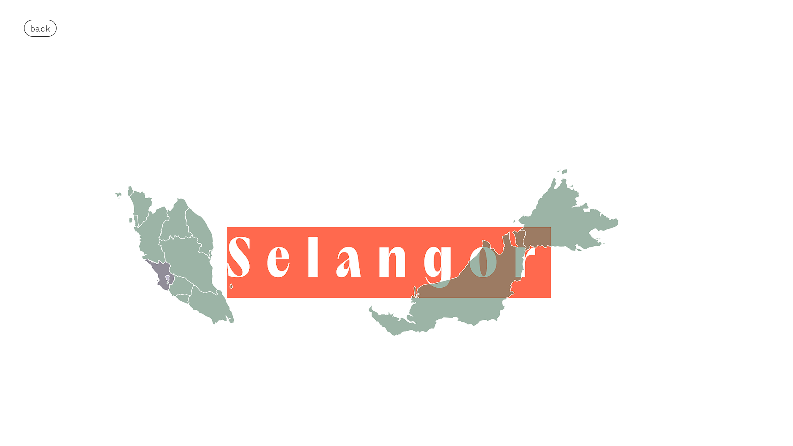

# MapJS
by Angus Tan 2024.

---

# What, Why, How

Interactive world map.
- Able to unlock country by input country to hasTravelled in the **world config file**.
- Able to unlock state by input state to hasTravelled in the **country config file**
- Able to put data into each state inside the **state config file**
- Visualize the place you've been with FUN!
- What's cool? It's serverless & easy to use!

---

# Assets
World Map
- not founded yet, included in the package

Country Map
https://simplemaps.com/resources/svg-us

---